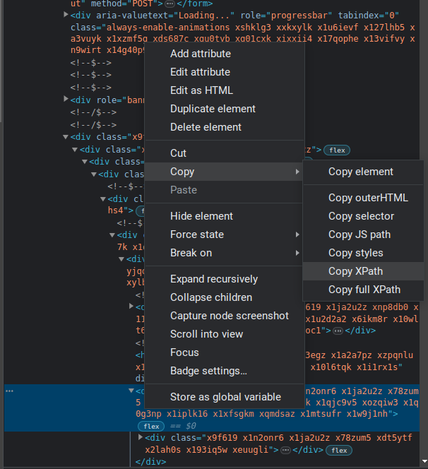
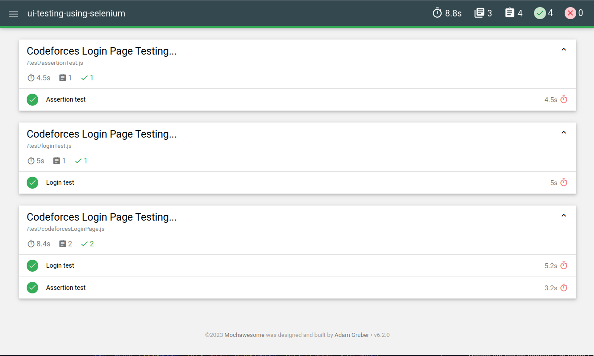

<div align="center">
  <h1>UI Testing Using Selenium WebDriver</h1>
</div>

This repository is a dedicated hub for honing and enhancing UI testing proficiency with **Selenium WebDriver**. It offers a straightforward entry point for those eager to delve into UI testing, providing practical, hands-on experience to sharpen their skills.

<p align="center">
  <span>Feel free to reach out to me! 😊</span> <br/>
  <a href="https://www.linkedin.com/in/tajnur" target="_blank">LinkedIn</a> ||  <a href="https://www.facebook.com/tajnur007 target="_blank"">Facebook</a>
</p>

## List of Contents

  - [Key Features and Purposes](#key-features-and-purposes)
  - [Prerequisite](#prerequisite)
  - [Project Setup](#project-setup)
  - [First Test](#first-test-login-testing)
  - [Assertion Testing Using _Node_](#assertion-testing-using-node-equality-checking)
  - [Assertion Testing Using _Chai_](#assertion-testing-using-chai-equality-checking)
  - [Making Test More Describable](#making-test-more-describable)
  - [Parallel Testing](#parallel-testing)
  - [Adding Report Generator](#adding-report-generator)
  - [Conclusion](#conclusion)
  - [Contribution Guideline](#contribution-guideline)

## Key Features and Purposes

  - **Learning UI Testing:** The primary goal of this repository is to facilitate learning and skill development in UI testing. By leveraging Selenium WebDriver, you can gain practical knowledge of automating tests on web applications' user interfaces.
  - **Hands-on Practice:** This repository encourages hands-on practice by providing a pre-configured setup for UI testing with Selenium WebDriver. It offers a foundation for writing and executing UI test scripts, allowing you to practice test automation techniques specific to the user interface.
  - **Test Case Development:** This repository emphasizes the creation and execution of test cases that target different UI elements, interactions, and scenarios. It encourages you to explore various functionalities of Selenium WebDriver, such as locating elements, interacting with forms, validating UI behavior, and handling user inputs.
  - **Test Framework Exploration:** As you progress, you can extend the repository to include test frameworks such as Mocha or Mochawesome. These frameworks enable better test organization, test suite creation, test execution, and reporting capabilities, providing a more comprehensive testing solution.
  - **Collaboration and Community Engagement:** This repository is open for collaboration, allowing others to contribute, provide feedback, and share their own UI testing practices. It serves as a platform for knowledge exchange, fostering a community of UI testing enthusiasts and practitioners. Checkout <a href="#contributingGuide">Contributing Guide</a>
  - **Documentation and Resources:** The repository includes documentation and resources to support your learning journey. This includes guidance on setting up the development environment, usage instructions for running tests, and best practices for writing effective UI test scripts using Selenium WebDriver.


## Prerequisite

To run our project, we need to install **Node.js**. I assume that you had already installed **node** in your machine. If you don't have then you can get it from [here](https://nodejs.org/en "Node.js").


## Project Setup

Open your terminal/command prompt where you want to setup this project. Create a directory using command `mkdir ui-testing-using-selenium`, navigate to the directory using command `cd ui-testing-using-selenium`. Now initialize your project setup using command `npm init -y`, this command will create a `package.json` file with some default configuration, if you want to add manually then skip the `-y` flag.

Now we will install `selenium-webdriver` and `chromedriver` into our project, run `npm install selenium-webdriver chromedriver`. I'm using Google Chrome browser for testing, if you want to use Firefox or Safari then install `geckodriver` or `safaridriver` respectively instead of `chromedriver`. Now we have finished our project setup.


## First Test (Login testing)

At first, we will create a folder `test` into project's root folder. We will put our test files into this `test` folder. We are going to test a simple login attempt with wrong credentials. Here I'm choosing the [**Codeforces**](https://codeforces.com/enter) login page to test. Let's see the code snippet below: 

_test/codeforcesLoginPage.js_
```javascript
const { Builder, By, Key } = require('selenium-webdriver');
require('chromedriver');

async function loginTest() {
  // Open chrome browser
  const driver = new Builder().forBrowser('chrome').build();

  // Navigate to the codeforces login page
  await driver.get('https://codeforces.com/enter?back=%2F');

  // Enter email, wrong password and try to login
  await driver.findElement(By.id('handleOrEmail')).sendKeys('tajnur007@gmail.com');
  await driver.findElement(By.id('password')).sendKeys('123456', Key.RETURN);

  // Quit browser after 3 seconds
  setTimeout(async () => {
    await driver.quit();
  }, 3000);
}

loginTest();
````

What we did in the upper code block? First we imported **Builder**, **By** and **Key** from `selenium-webdriver` and also imported the `chromedriver`. Now we have defined a async function named as `loginTest()`. In the `loginTest()` function, we oppened our chrome browser by using `new Builder().forBrowser('chrome').build();` command and stored it into a constant variable `driver`. Now we will navigate to the Codeforces login page. To do so, later we called `get()` method with the login page url. As we need time to navigate in the page, we used `await` keyword, this will help us working as synchronously.

There have two input fields for inserting Handle/Email and Password in the login page. We are going to point these two input fields using their id by the help of `findElement()` method and sending the values using `sendKeys()` method. Here the `Key.RETURN` command will submit the form. I gave a wrong password for testing an invalid login attempt. You can also test a successfull login using a correct credential. At last, we closed our chrome browser after 3 seconds.

Now, save the codes, open your editor's terminal and run `node test/codeforcesLoginPage.js` this command. If everything is fine then I hope you will see the behaviour I have described above. 


## Assertion Testing Using _Node_ (Equality checking)

We will add this test into the previous file. We have to import the Node's default assert into this file first before using it. After that, we will add another function `assertionTest()` as follows: 

_test/codeforcesLoginPage.js_
```javascript
const assert = require('assert');

async function assertionTest() {
  const driver = new Builder().forBrowser('chrome').build();
  await driver.get('https://codeforces.com/enter?back=%2F');

  const emailText = await driver.findElement(By.xpath('//*[@id="enterForm"]/table/tbody/tr[1]/td[1]')).getText();
  const passText = await driver.findElement(By.xpath('//*[@id="enterForm"]/table/tbody/tr[2]/td[1]')).getText();

  assert.strictEqual(emailText, 'Handle/Email');
  assert.strictEqual(passText, 'Password');

  await driver.quit();
}

assertionTest();
````

Here we are getting two element's text by their **XPath**. To copy the xpath of an element, you have to inspect that element, right click on that element and select **Copy XPath** from the **Copy** section.

<div style="display: flex; justify-content: center; margin-bottom: 10px">
  
</div>

We are checking the email and password labels are strictly equal or not equal to `'Handle/Email'` and `'Password'` respectively. The methods are pretty user-friendly to understand what we are actually doing. Let's invoke this method and run the command `node test/codeforcesLoginPage.js` You can also check this test with wrong text matching thus you can verify that your code is working as expected or not.


## Assertion Testing Using _Chai_ (Equality checking)

At this phase, we are going to check the previous test but this time we will use [Chai](https://www.chaijs.com/) (Chai is a BDD / TDD assertion library for node and the browser that can be delightfully paired with any javascript testing framework). You have to install this package first before starting this test, run `npm install chai`. 


_test/codeforcesLoginPage.js_
```javascript
const should = require('chai').should();

async function assertionTest() {
  const driver = new Builder().forBrowser('chrome').build();
  await driver.get('https://codeforces.com/enter?back=%2F');

  const emailText = await driver.findElement(By.xpath('//*[@id="enterForm"]/table/tbody/tr[1]/td[1]')).getText();
  const passText = await driver.findElement(By.xpath('//*[@id="enterForm"]/table/tbody/tr[2]/td[1]')).getText();

  emailText.should.equal('Handle/Email');
  passText.should.equal('Password');

  await driver.quit();
}

assertionTest();
```

Here we did nothing special, just used Chai's **should()** method to check eqality. There have more features for assertion testing using Chai. Why I had choosen Chai over Node's built-in `assert`? I perfer Chai because it:
  - provides a more expressive and human-readable syntax for writing assertions
  - supports various assertion styles, including BDD (Behavior-Driven Development) and TDD (Test-Driven Development) styles, which can make your test code more descriptive and easier to understand.
  - supports multiple assertion styles
  - provides more descriptive error messages when assertions fail
  - can be easily integrated with popular testing frameworks like Mocha, Jasmine, and Jest


## Making Test More Describable

Everytime when we are running a test file then we have to run `node [file_path_name]` e.g. `node test/codeforcesLoginPage.js`. Let assume that we have more files into our **test** folder. Everytime manually running an individual file to test is boring, right? And the test is not showing any specific result about our test. So now we are going to use [Mocha](https://mochajs.org/) in our project to make our test more describable. comment

What is **Mocha**? Mocha is a popular JavaScript testing framework primarily used for testing Node.js applications and JavaScript code in general. It is known for its flexibility and extensibility, making it a popular choice among developers for writing unit tests, integration tests, and even end-to-end tests for web applications. In a project directory, if there have a folder named as `test`, or in any directory if there have any file named with `.spec.js` or `.test.js` extension then Mocha will run automatically all files those are into the `test` folder or named with `.spec.js` and `.test.js` in any folder.

To install this package, we have to run `npm install mocha` command, you can also install this package into your project as a dev dependency with `--save-dev` flag, i.e. `npm install mocha --save-dev`. Now we will add/modify a script into our `package.json` file.

_package.json_
```json
..................
..................
"scripts": {
  "test": "mocha --no-timeouts"
},
..................
..................
```

Now we will add following code into our `codeforcesLoginPage.js` file.

```javascript
/**
 * Function calls
 */
describe('Codeforces Login Page Testing...', function() {
  it('Login test', async function() {
    await loginTest();
  });

  it('Assertion test', async function() {
    await assertionTest();
  });
});
```

Mocha uses a **BDD** (Behavior-Driven Development) style syntax for writing tests. We typically uses the `describe` and `it` functions to structure our tests:

  - `describe`: Used to group related test cases. It takes a string description and a callback function.
  - `it`: Defines an individual test case. It also takes a string description and a callback function containing the test logic.

From now we will run our tests using `npm run test` command, it will execute the `mocha --no-timeouts` script and Mocha will look for test files in the current directory and its subdirectories. I believe, you will be informed about the testing and it's results.


## Parallel Testing

In a production level project, there may have lots of test cases and lots of testing files. Everytime Mocha will run every tests sequentially, thus it requires huge time to complete all of the test cases. Here parallel testing can save our time. Mocha providing us the parallel testing feature and we can do it by adding `--parallel` flag into our `test` script:

_package.json_
```json
"scripts": {
  "test": "mocha --no-timeouts --parallel"
},
```

Here I have copied the `loginTest()` and `assertionTest()` into two different file named as `loginTest.js` and `assertionTest.js` respectively to check the parallel testing.

_test/loginTest.js_
```javascript
const { Builder, By, Key } = require('selenium-webdriver');
require('chromedriver');
const assert = require('assert');
const should = require('chai').should();


/**
 * Function definations
 */
async function loginTest() {
  const driver = new Builder().forBrowser('chrome').build();
  await driver.get('https://codeforces.com/enter?back=%2F');

  // Enter email, wrong password and try to login
  await driver.findElement(By.id('handleOrEmail')).sendKeys('tajnur007@gmail.com');
  await driver.findElement(By.id('password')).sendKeys('123456', Key.RETURN);

  await driver.quit();
}


/**
 * Function calls
 */
describe('Codeforces Login Page Testing...', function() {
  it('Login test', async function() {
    await loginTest();
  });
});
```

_test/assertionTest.js_
```javascript
const { Builder, By, Key } = require('selenium-webdriver');
require('chromedriver');
const assert = require('assert');
const should = require('chai').should();

async function assertionTest() {
  const driver = new Builder().forBrowser('chrome').build();
  await driver.get('https://codeforces.com/enter?back=%2F');

  const emailText = await driver.findElement(By.xpath('//*[@id="enterForm"]/table/tbody/tr[1]/td[1]')).getText();
  const passText = await driver.findElement(By.xpath('//*[@id="enterForm"]/table/tbody/tr[2]/td[1]')).getText();

  // Node assertion test
  assert.strictEqual(emailText, 'Handle/Email');
  assert.strictEqual(passText, 'Password');

  // Chai assertion test
  emailText.should.equal('Handle/Email');
  passText.should.equal('Password');

  await driver.quit();
}


/**
 * Function calls
 */
describe('Codeforces Login Page Testing...', function() {
  it('Assertion test', async function() {
    await assertionTest();
  });
});
```

Now we will run `npm run test` command. I hope, you can see the behavior of parallel testing.


## Adding Report Generator

I would like to generate a report file rather than showing testing results in terminal. We can use **Mochawesome** package to generate a custom report as a result of our testing. Mochawesome is a popular JavaScript package primarily used for enhancing the reporting capabilities of Mocha. It provides several valuable features for improving the test reporting experience. I will not show the detail uses of this package, I will discuss about basic uses of this package but if you want to learn more then you can [checkout this](https://github.com/adamgruber/mochawesome#mochawesome).

Now we will install `mochawesome` into our project as dev-dependency, run `npm install mochawesome --save-dev`. After successful installation we will modify our `test` script as following:

```json
"scripts": {
  "test": "mocha --no-timeouts --parallel --reporter mochawesome --require mochawesome/register"
}
```

Here we added `--reporter mochawesome --require mochawesome/register` this extra piece of code. Now run `npm run test` command and you can notice that there have created a new directory named as **mochawesome-report**. Into the directory, there have **mochawesome.html** file, this file contains our test results as web view, other files and directories are supportive files to the **mochawesome.html** file. Open this file (**mochawesome.html**) from your browser to see the testing results. You may see the result as the image below.

<div>
  
</div>

If you want to generate this report into custom location as well as custom file name then you can do it by adding extra flag `--reporter-options` with `reportDir` and `reportFilename`, e.g. `--reporter-options reportDir=/home/tajnur/Desktop/TAJNUR/ui-testing-using-selenium/test-report,reportFilename=testResults.html`. Thus our `test` script will be as follows:

```json
"scripts": {
  "test": "mocha --no-timeouts --parallel --reporter mochawesome --require mochawesome/register --reporter-options reportDir=/home/tajnur/Desktop/TAJNUR/ui-testing-using-selenium/test-report,reportFilename=testResults.html"
}
```

**Optional:** I would like to add one more command into the `test` script thus it can show me automatically the testing report after generating the report. For me, the command `google-chrome ./test-report/testResults.html` will show me the test result (I'm using **Linux OS**), so I also added this command into the `test` script.

```json
"scripts": {
  "test": "mocha --no-timeouts --parallel --reporter mochawesome --require mochawesome/register --reporter-options reportDir=/home/tajnur/Desktop/TAJNUR/ui-testing-using-selenium/test-report,reportFilename=testResults.html; google-chrome ./test-report/testResults.html;"
}
```


## Conclusion

In this enlightening tutorial, we've embarked on a captivating journey, albeit just scratching the surface of the vast realm of UI testing. There exists an expansive landscape waiting to be explored, with countless opportunities to craft additional tests and scenarios that can fortify your UI testing prowess.

While this tutorial may not claim the title of an absolute UI testing masterpiece, I firmly believe it serves as a stepping stone, guiding you onto this exciting path. Your journey into the world of UI testing has only just begun.

I eagerly await your feedback and warmly welcome your contributions to enhance this tutorial and project. Please, feel unreservedly encouraged to share your invaluable experiences and show your appreciation by bestowing a **star** upon this repository if it resonated with you. Your support means the world to me, igniting the flames of enthusiasm in my open-source contribution journey. You can also share your experience with me by sending an email to <a href="mailto:tajnur007@gmail.com">tajnur007@gmail.com</a>.


## Contribution Guideline

I want to make contributing to this project as easy and transparent as possible. I will do my best to keep the `main` branch in good shape. I actively welcome your **pull requests**:

  1. Fork this repo and create your branch from `main`.
  2. If you've added code that should be tested, I will verify that.
  3. If you've changed any code which requires to update documentation then update the documentation.
  4. Make sure your code lints and is formatted.

Please file issues liberally, I'm using GitHub issues to track public bugs. Please ensure your description is clear and has sufficient instructions to be able to reproduce the issue.
